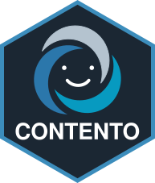

::::: columns
::: {.column width="75%"}
# CONTENTO

> *CONTrast ExploratioN Toolkit for Omics*!
:::

::: {.column width="25%"}
{fig-align="right" width="100"}
:::
:::::

## Documentation

Full documentation, including tutorials for creating SE and annotation files, is available at: <https://klemonlab.github.io/CONTENTO/>

## Running CONTENTO

CONTENTO can be run in two ways. We recommend the container, since it ships with R, Bioconductor, and every dependency pre-installed, and behaves identically on any operating system.

### *Option 1:* Run the container (recommended)

A container bundles the app together with everything it needs to run. You only need to install a container runtime once:

- **macOS and Windows:** [Podman Desktop](https://podman-desktop.io/), free and open source. Docker Desktop also works, but requires a paid subscription at larger organizations (more than 250 employees or more than \$10 million in annual revenue), which usually includes universities and hospitals.
- **Linux:** [Docker Engine](https://docs.docker.com/engine/install/) or Podman, both free and available from your distribution's package manager.

Then start CONTENTO from a terminal *(with Podman Desktop running)*:

```{bash}
podman run --rm -p 3838:3838 ghcr.io/klemonlab/contento:latest
```

If you use Docker, replace `podman` with `docker`; the rest of the command is identical. The first run downloads the image, which takes a few minutes. When the terminal shows `Listening on http://0.0.0.0:3838`, open your web browser and navigate to:

```         
http://localhost:3838
```

Press `Ctrl+C` in the terminal to stop the app.

**Loading your data.** Upload your SE file in the app's sidebar, and an annotation file from the load panel if needed. Built-in annotations are included in the container and load automatically when `metadata(se)$annotation` names one of them. Uploaded files are only kept for the current session.

**Using your own annotation files.** To load your own annotation files automatically instead of uploading them each session, mount the folder that contains them and point `CONTENTO_ANNOTATION_DIR` to it:

```{bash}
podman run --rm -p 3838:3838 \
    -v /path/to/annotations:/annotations:ro \
    -e CONTENTO_ANNOTATION_DIR=/annotations \
    ghcr.io/klemonlab/contento:latest
```

**Pinning a version.** `latest` always points to the newest release. For analyses you intend to publish, replace `latest` with a specific release version (see [Releases](https://github.com/KLemonLab/CONTENTO/releases)) and report that version in your methods:

```{bash}
podman run --rm -p 3838:3838 ghcr.io/klemonlab/contento:0.2.0
```

**Building the image yourself.** A Dockerfile is included in the repository, so you can build and run the image locally from the cloned repository:

```{bash}
podman build -t contento .
podman run --rm -p 3838:3838 contento
```

### *Option 2:* Run locally within R/RStudio

Some users may prefer to execute **CONTENTO** directly from an existing R installation, usually used in conjunction with the popular IDE [RStudio](https://posit.co/download/rstudio-desktop).

Clone the CONTENTO repository:

```{bash}
git clone https://github.com/klemonlab/contento.git
```

After opening the project (`CONTENTO.Rproj`) within Rstudio, install the dependencies by running:

```{r}
install.packages(c(
    "shiny",
    "shinydashboard",
    "shinycssloaders",
    "DT",
    "plotly",
    "tidyverse",
    "purrr",
    "viridis",
    "RColorBrewer",
    "ComplexUpset",
    "scales",
    "ggiraph",
    "gridExtra",
    "patchwork"
))

if (!requireNamespace("BiocManager"))
    install.packages("BiocManager")

BiocManager::install(c(
    "ComplexHeatmap",
    "DESeq2",
    "fgsea",
    "msigdbr",
    "circlize",
    "SummarizedExperiment"
))
```

Open `app.R` in RStudio and click the interactive **:arrow_forward: Run App** button, or execute:

```{r}
shiny::runApp("app.R")
```

The application will then become available in your web browser.

------------------------------------------------------------------------

## Citation

If you use this application in scientific work, please cite:

Isabel FE, et al. "CONTENTO: CONTrast ExploratioN Toolkit for Omics". <https://github.com/KLemonLab/CONTENTO>

DOI: <https://doi.org/10.5281/zenodo.21629492>

This DOI always resolves to the latest release; the DOI for each specific version is listed on the Zenodo page.

## License

This project is covered under the GPL-3 license.

## Contact

Issues, bug reports, and feature requests are welcome through the GitHub issue tracker.
